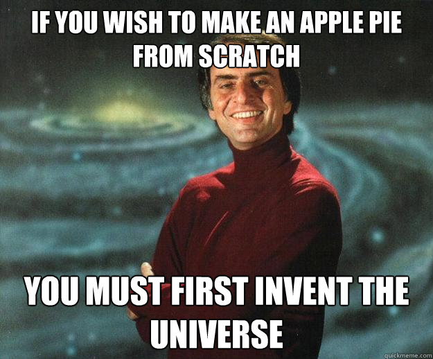

# Express API + Sequelize

## Objectives

By the end of this, developers should be able to:

- Write five CRUD endpoints for an API resource by integrating Express and Sequelize to 
  implement a REST service.

## Let's Talk About A World Without Magic



## Our Workflow

Up until now, we have been occasionally using Git in our workflow. But that changes today. From now onwards, we will use Git in every step of the way.

## Practice Makes Perfect

So let's make a new Express API App that will use Sequelize.

```
mkdir express-api
cd express-api
```

```
npm init
```

```
npm install express babel-cli babel-preset-es2015 --save
```

```
touch .babelrc
```

```
{
  "presets": ["es2015"]
}
```

Let's finish setting up our development environment.

```
npm i nodemon --save-dev
```

Add this line in `package.json` under the `scripts` section.

```javascript
"start": "node_modules/.bin/nodemon app.js --exec babel-node --",
```

Now that is out of the way, we need to create/open the `app.js` file.

If you haven't already run `git init`, then lets' run it now and create the `.gitignore` file.

Though, how do we know which files and folders should we ignore for a project?

Well, we [look it up](https://www.gitignore.io/).

With the project setup, let's write a skeleton Express app that welcomes the user at the root path.

### CRUD _Time_

Let's talk about **CRUD**! What does it stand for?

Let us start with the easy part first. By focusing on the **R** part to read data and show it to the user.

To do that, let's start by writing a dummy route to show a list of people.

Add a Route to List People:

<details>
  <summary>Solution:</summary>

```javascript
const people = [
  {firstName: 'Usman', lastName: 'Bashir'},
  {firstName: 'Michael', lastName: 'Finneran'},
  {firstName: 'Ghadeer', lastName: 'Alkhathlan'},
];

app.get('/api/people', (req, res) => {
  res.status(200).json({ people: people });
});
```
</details>

Now that we are returning a functional list of dummy people to the user. We will connect it to the database. Where we will get the list of all people and render it as a JSON list in our API.

Though, first things first. Let's connect Sequelize with Express.

If you don't already have this then install it:

```bash
npm install sequelize-cli --save
```

Now, install the ORM, CLI, and Postgres dialect:

```bash
npm install sequelize pg pg-hstore --save
```

Setup Sequelize:

```bash
node_modules/.bin/sequelize init
```

Let's update our `config/config.json` file for Sequelize to be able to connect to our database server.

```json
"development": {
  "username": "postgres",
  "password": "1234",
  "database": "express_api_database_development",
  "host": "127.0.0.1",
  "dialect": "postgres",
  "define": {
    "underscored": true
  }
},
"test": {
  "dialect": "sqlite",
  "storage": ":memory:"
},
```

Create DB:

```bash
node_modules/.bin/sequelize db:create
```

Let's create our first Model and check-out our new model and migration files.

```bash
node_modules/.bin/sequelize model:create --name Person --attributes "first_name:string, last_name:string"
```

Next step, run:

```bash
node_modules/.bin/sequelize db:migrate
```

We should now have our table created for us.

That's great and all, but this new table is going to be empty. Meaning there is nothing to show.

So we will create a seed file to add a few people to the Person table.

```bash
node_modules/.bin/sequelize seed:create --name people
```

Update People Seeder File:

**Up:**

```javascript
return queryInterface.bulkInsert('People', [
  {first_name: 'Usman', last_name: 'Bashir', created_at: new Date, updated_at: new Date},
  {first_name: 'Michael', last_name: 'Finneran', created_at: new Date, updated_at: new Date},
  {first_name: 'Ghadeer', last_name: 'Alkhathlan', created_at: new Date, updated_at: new Date},
], {});
```

**Down:**

```javascript
return queryInterface.bulkDelete('People', null, {});
```

With that done, let's seed the **db**:

```node_modules/.bin/sequelize db:seed:all```

Let's see what it added to our database.

```bash
psql -h localhost -U "postgres" express_api_database_development

\l List DB
\d List table
\d "TABLE_NAME" List Table columns
```

That's great, now let's finish this by getting the data from the database and showing it to the user.

<details>
  <summary>Solution:</summary>

```javascript
import models from './models';

app.get('/api/people', (req, res) => {
  models.Person.findAll()
    .then(people => {
      res.status(200).json({ people: people });
    })
    .catch(e => console.log(e));
});
```
</details>

Congrats, you know have a real API endpoint that can read from the database and show it to the user.

Now that we know how to get data from the database. Let's do another version of it where the user can ask for information about a specific person.

How would we do that?

<details>
  <summary>Solution:</summary>

```javascript
app.get('/api/people/:id', (req, res) => {
  res.status(200).json({ user_id: req.params.id });
});
```
</details>

Okay, that's a good start. What do we need to do next?

We need to connect this API endpoint to our database.

<details>
  <summary>Solution:</summary>

```javascript
app.get('/api/people/:id', (req, res) => {
  models.Person.findByPk(req.params.id).then(person => {
    res.status(200).json({ person: person });
  })
  .catch(e => console.log(e));
});
```
</details>

This is cool! But what happens when we ask for a person with an ID that does not exist in the DB?

Sequelize will return a null object if it could not find the record.

Which we can take advantage of.

<details>
  <summary>Solution:</summary>

```javascript
app.get('/api/people/:id', (req, res) => {
  models.Person.findByPk(req.params.id).then(person => {
    if(person !== null) {
      res.status(200).json({ person: person });
    } else {
      res.status(404).json({ error: 'Person Not Found'});
    }
  })
  .catch(e => console.log(e));
});
```
</details>

That's awesome! But what happens if the user sends a letter instead of a number?

Yeah, we need to make sure they can't do that.

How can we do that?

<details>
  <summary>Solution:</summary>

```javascript
app.get('/api/people/:id', (req, res) => {
  if(!isNaN(req.params.id)) {
    models.Person.findByPk(req.params.id).then(person => {
      if(person !== null) {
        res.status(200).json({ person: person });
      } else {
        res.status(404).json({ error: 'Person Not Found'});
      }
    })
    .catch(e => console.log(e));
  } else {
    res.status(406).json({ error: 'Invalid ID' })
  }
});
```
</details>

That's a lot of work, isn't it? Well, that's what you have to do when there is no Magic to take care of things for you.

Okay, enough reading data. Let's move on to the Create part of CRUD.

Lets set up a route to handle post request for creating a new person.

<details>
  <summary>Solution:</summary>

```javascript
app.post('/api/person', (req, res) => {
  res.status(201).json({ result: 'Working...' });
});
```
</details>

That's fine, but how do we read data submitted in a post request?

```
npm i body-parser --save
```

```javascript
res.status(201).json({ result: req.body });
```

<details>
  <summary>Solution:</summary>

```javascript
app.post('/api/person', (req, res) => {
  models.Person.create(req.body).then(person => {
    res.status(201).json({ person: person });
  })
  .catch(e => console.log(e));
});
```
</details>

Great, we now have an API that lets us see a list of all the people or details about one of them and it even allows us to create a new person.

With that, we have implemented the **C**, and **R** parts of **CRUD**.

Now it is up to you to implement the **U**, and **D** parts of **CRUD** in a lab right now based on what we have learned today.

## Lab

**To Do:**

1. Update existing Person
1. Delete existing Person

## Reference

- [HTTP Statuses - Cat Edition](https://http.cat/)
- [HTTP Statuses - Plain](https://httpstatuses.com/)
